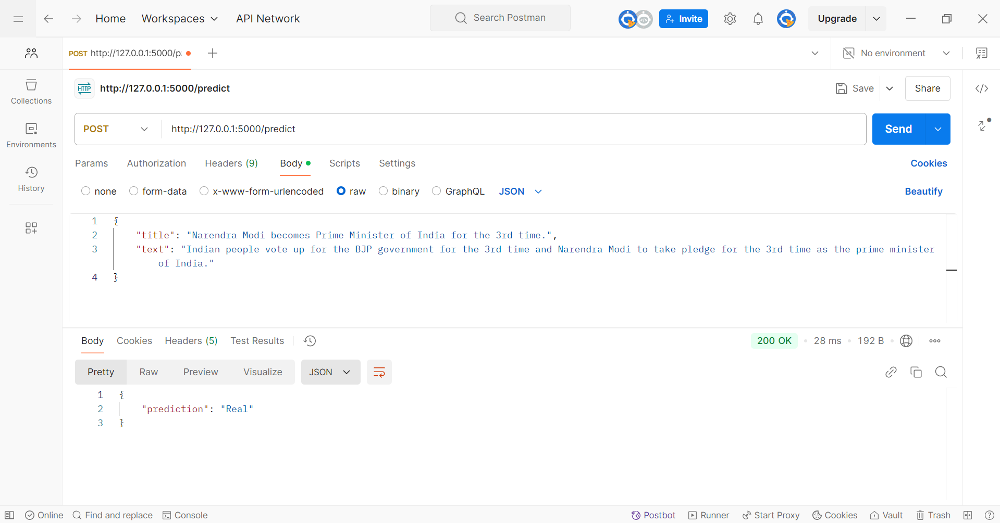

# Team-Infinity-SSH-BHU

# Fake News Detection API

This repository contains a Flask-based API that serves a machine learning model for detecting fake and real news articles. The model uses Logistic Regression and Random Forest classifiers, and the API provides a prediction endpoint that can classify news as "Real" or "Fake."

---

## Features

- **Model:** Logistic Regression and Random Forest classifiers.
- **Accuracy:** Around 98% for Logistic Regression and 97% for Random Forest.
- **API Endpoints:**
  - `/`: A welcome message indicating the API is up and running.
  - `/predict`: A POST endpoint that accepts news article data and returns a classification (Real or Fake).

---

## Screenshots
### Prediction Example
Here’s a successful prediction response for a news article:



---

## Setup and Installation

Follow these steps to set up and run the API locally:

### Prerequisites

Ensure you have the following installed:
- Python 3.x
- pip (Python's package installer)

### Steps

1. **Clone the repository:**

   ```bash
   git clone https://github.com/idamodhar17/fake-news-detection-api.git
   cd fake-news-detection-api
   ```

2. **Create a virtual environment (optional but recommended):**

   ```bash
   python3 -m venv venv
   # put the lines in the source of project directory
   cd ./venv/Scripts
   ./activate
   ```

3. **Install dependencies:**

   Install the required packages using `pip`:

   ```bash
   pip install -r requirements.txt
   ```

4. **Place your model and vectorizer files:**

   Ensure the following files are in the project directory:
   - `news_classification_model.pkl` (the trained model)
   - `tfidf_vectorizer.pkl` (the vectorizer for transforming input text)

5. **Run the API:**

   Start the Flask development server:

   ```bash
   python flaskAPI.py
   ```

   The API will be running at `http://127.0.0.1:5000/`.

---

## API Usage

### 1. Test if the API is running

Visit `http://127.0.0.1:5000/` in your browser or use curl to check if the API is running.

```bash
curl http://127.0.0.1:5000/
```

Response:

```json
{
  "message": "Welcome to the News Classification API!"
}
```

### 2. Predict Fake or Real News

Send a POST request to `/predict` with the following JSON body:

```json
{
  "title": "Breaking News: New AI Model Released",
  "text": "A new AI model for detecting fake news has been released today."
}
```

Using `curl`:

```bash
curl -X POST -H "Content-Type: application/json" \
  -d '{"title": "Breaking News: New AI Model Released", "text": "A new AI model for detecting fake news has been released today."}' \
  http://127.0.0.1:5000/predict
```

Response:

```json
{
  "prediction": "Real"
}
```

Error example (missing `title` or `text`):

```json
{
  "error": "Both 'title' and 'text' fields are required"
}
```